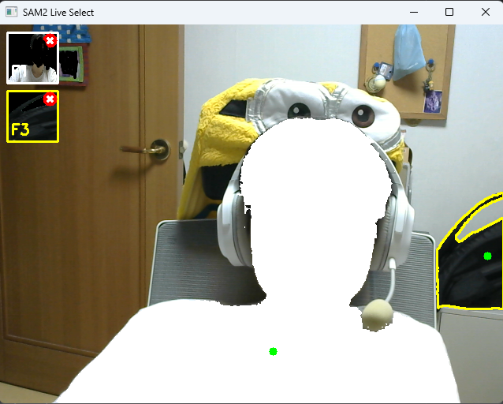

# CV_project
Computer Vision project  
meta 의 SAM2 모델을 사용하여 영상 및 이미지에서 객체를 탐지하고, 해당 객체의 위치를 표시하는 프로젝트.  
# SAM2
https://github.com/facebookresearch/sam2?tab=readme-ov-file

# getting started
### 설치
```
cd checkpoints && \
./download_ckpts.sh && \
cd ..
```
혹은 https://github.com/facebookresearch/sam2?tab=readme-ov-file#getting-started 에서 직접 체크포인트를 다운로드하여 checkpoints 폴더에 넣어도 됩니다.

# real-time object detection
실시간으로 객체를 탐지하여 mask를 표시하는 기능을 구현했다.
### 사용법
1. 연결된 카메라로 실시간 영상을 받아옴
2. 마우스 클릭으로 좌표 설정 (최대 두개)
3. 왼쪽의 리스트에서 필터 변경 가능

- 실행 예시 (tiny 모델 사용)  
  
실행환경 : Python 3.10.16, PyTorch 2.5.1+cu121, CUDA 12.4.1, GPU NVIDIA GeForce RTX 4060 Ti

# vedio object detection
비디오에서 객체를 탐지하여 mask를 표시하는 기능을 구현했다.
sam2 의 example [video_predictor_example.ipynb](https://colab.research.google.com/github/facebookresearch/sam2/blob/main/notebooks/video_predictor_example.ipynb) 를 참고하여 구현했다.  
단순히 ipynb 파일을 python 으로 변환한것으로, 가장 큰 목적은 모델의 성능 파악이었다.
### 사용법
1. 비디오 파일을 videos/ 경로에 넣는다.
2. `ffmpeg -i <your_video>.mp4 -q:v 2 -start_number 0 videos/frames/'%05d.jpg`
3. 실행 후 스페이스 바로 일시정지 / 재생
4. 일시정지 상태에서 마우스 클릭으로 객체 선택 (최대 세 개)
5. 이후 선택한 객체의 mask가 표시됨

- 실행 예시  


# 결론
이 프로젝트는 meta 의 SAM2 모델을 사용하여 객체 탐지 및 마스킹 기능을 구현했다.  
추가적으로 실시간 객체 탐지 및 비디오 객체 탐지 기능을 구현하여, 다양한 환경에서 모델의 성능을 평가할 수 있었다.  
특히 앞뒤로 교차하는 상황에서도 tiny 모델임에도 불구하고 오차가 적어, 모델의 성능이 우수함을 확인할 수 있었다.
만약 하드웨어 성능이 더욱 올라간다면, 실시간 객체 탐지를 더욱 원활하게 구현할 수 있을 것이다.  
이는 애플의 vision pro와 같은 AR 기기에서 실시간으로 영상 처리를 더욱 효율적으로 수행할 수 있는 가능성을 보여준다.